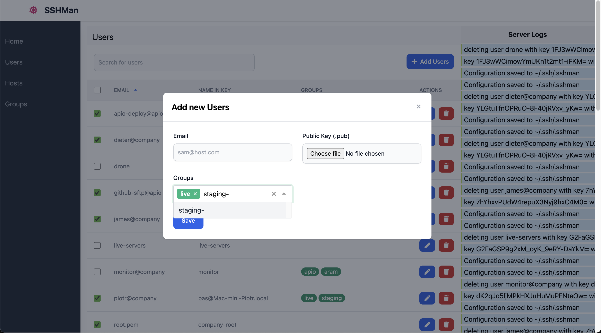

# SSH Manager - manage authorized_key file on remote hosts

[](https://github.com/shoobyban/sshman/actions/workflows/push.yaml)
[](https://github.com/avelino/awesome-go)
[](https://goreportcard.com/report/github.com/shoobyban/sshman)

This is a simple tool that I came up after having to on-boarding and off-boarding developers on a wide of environments from AWS to 3rd party hosting providers.

As every one of my creations this tool is solving _my_ problems. It does not warranty your problem will be solved, but in that highly unlikely event please let me know, fixes and pull requests, issues are all very welcome without again the promise that I'll do anything, I'm normally really busy, apologies.

**Caution**: Plan your group memberships carefully, keep your management key out of any groups so you don't accidentally remove management key from any host, locking yourself out.

## Installation

```sh
$ go get github.com/shoobyban/sshman
```

## How does it work?

This tool needs to be run from a host that will be able to access all hosts with a working ssh key, one you don't share with anybody else. Configuration is saved into `~/.ssh/.ssmman`, if you need to move tool to any other host, copy this and the binary and you are set up. Configuration will not have any sensitive information.

There are two main resource entities in sshman: users and hosts. Users are identified by the public ssh key and labeled by their email address for simplicity, although email address is not used as an email so can be anything like sam-key-1 sam-key-2, useful when a user has multiple keys for different purposes (this is absolutely not necessary in most cases, but sshman supports it).


The main concept of sshman is group, organising users onto "group of hosts" or hosts by "group of users", like `live-hosts`, `staging-hosts`, `production`, or `{client1}`, `{client2}`, but you can also create "groups" for every email address or every host. Groups are like tagging, by tagging a user and a host with the same group name the user will be able to access the host.

To add a host into the sshman configuration, provide an alias, an ssh `.pub` keys and groups that the host belongs to if already defined. Adding the host will initiate an auto-discovery functionality that will download all ssh keys from the host as newly defined users and create pseudo groups for recognised users that have access to that host.



### Configuration file

Configuration is saved into `~/.ssh/.ssmman`, it is a JSON file with all hosts, users and groups. Probably configuration is not the right word for this.

## Usage

### Adding Hosts

First, you need hosts, that you can already access, with `~/.ssh/authorized_keys` files on the host. Password auth doesn't work yet, there are plans to support initial configuration through user+password.

To add a host, the syntax is

`sshman add host {alias} {host_address:port} {user} {~/.ssh/working_keyfile.pub} [group1 group2 ...]`

Where groups are optional, can be provided later.

Adding a host for example:

```sh
$ sshman add host google my.google.com:22 myuser ~/.ssh/google deploy hosting google
```

In this example `google` will be my alias, sshman will access `my.google.com` on port 22, with `myuser` user using `~/.ssh/google` private ssh key from the current user's folder, the host will belong to three groups: `deploy`, `hosting` and `google`. Sshman will save the given values into its configuration, access the host with the provided credentials, check for `~/.ssh/authorized_keys` file, download the users, cross-referencing them with the current user list, adding a new group when necessary.

### Adding Users

This is optional if you already have all the users on the hosts and you just want to be able to move them around, auto discovery will auto-add the users for you, but defining new users will require this step.

Syntax is

`sshman add user {email} {sshkey.pub} [group1 group2 ...]`

Where groups are optional, can be provided later.

For example:

```sh
$ sshman add user email@test.com ~/.ssh/user1.pub production-team staging-hosts
```

`email@test.com` will be the label, it doesn't have to be an email address, but easier to identify and have secondary administrative value. `~/.ssh/user1.pub` will be read into the configuration and can be discarded right after this step if not used anywhere else. The user in this example will belong to the groups `production-team` and `staging-hosts`, if there are hosts in these groups the user's public ssh key information will be added to the `~/.ssh/authorized_keys` files for all hosts where the user's key was still not on.

### Auto Discovery users on added hosts

To run auto discovery users on added hosts, or to refresh the configuration if any 3rd party has changed `~/.ssh/authorized_keys` files, run:

```sh
$ sshman update
```

### Listing who's on what host

```sh
$ sshman list auth
```

This will display host alias -> email list mapping, easy to grep or add to reports.

### Listing what user and host is in what group

Easier to explain this with an example scenario:

```sh
$ sshman list groups
production-team hosts: [client1.live live2 host3 client1.uat]
production-team users: [email1@test.com email2@company.com]
dev-team hosts: [staging.test.com client1.staging]
dev-team users: [junior1@test.com email1@test.com email2@company.com]
```

Notice that group alias is in every line with "hosts" and "users" for using `grep` on the list.

### Listing added hosts

Lists host aliases, what host/port, host is in what groups.

```sh
$ sshman list hosts
client1.staging        	staging.client1.com:22              [production-team dev-team]
client1.uat        	    uat.client1.com:22               	[production-team dev-team]
client1.live        	www.client1.com:22               	[production-team]
```

### Listing added users with groups

```sh
$ sshman list users
```

Will return a mapping of email to groups.

### Renaming users and hosts

Rename a user (modify email) or host (modify alias).

```sh
$ ./sshman rename user oldemail@host.com newemail@host.com

$ ./sshman rename host oldalias newalias
```

### Modifying user and host groupping

Modify user's groups, or remove groups from user to allow global access:

```sh
$ ./sshman groups user email@host.com group1 group2
```

Modify host groups or remove from all groups:

```sh
$ ./sshman groups host hostalias group1 group2
```

Note: Removing host from a group will remove all users that are on the host only because of that group. If the host is in another group, the users that are in both groups will not be removed.

### Things To Fix Before Release

- [x] Fix adding users
- [x] Bug: Adding host on frontend does not add keyfile entry into storage, edit afterwards does
- [x] Bug: Renaming host (alias) created a new entry, did not delete old
- [x] Group editing
  - [x] Add group should add users and groups
  - [x] Update group should remove / add resources
  - [x] Delete group should remove resources
- [x] Test all CRUD (users, hosts, groups) together
- [x] Re-read config with file watcher in web mode
- [x] Screenshot with test data (not with sensitive data)
- [x] Reuse stored ssh key for modifying user
- [x] Adding host to download information without the need of running update
- [x] Complete CRUD for missing use cases
- [x] Web interface
- [ ] Testing document for full coverage
- [ ] Configuration into interface so testing can be done without isTest() style checks
- [ ] All user functions should have unit tests
- [ ] All host functions should have unit tests
- [ ] All group functions should have unit tests
- [ ] All config functions should have unit tests
- [ ] All core functionality should have unit tests
- [ ] Edge case: deleting user should delete the user from all hosts (unless canceled from changeset)
- [ ] Misfeature: Changing keyfile on host does not upload new key with old and delete old
- [ ] Misfeature: Adding host does not check if host config is working
- [ ] Misfeature: Adding host with groups does not upload initial users from group
- [ ] Misfeature: Modifying user groups does not upload / delete hosts

### TODO For Next Release

- [ ] Web authentication
- [ ] Delete host with editing ssh keys
- [ ] Auto-group host specific users (when user is on several hosts, create a group for them, auto-merge groups when possible)
- [ ] CLI to use API (not sure)
- [ ] Web Interface Authentication (where to store creds?)
- [ ] Updated At timestamps
- [ ] Audit log
  - [ ] audit log logging all changes from changeset (sync op) on apply
- [ ] Implement user "role" group of groups for RBAC level of abstraction (developers role = uat-servers+staging-servers group)
- [ ] Testing connection after creating authorized_keys entry

### (Possible) Future Plans

- [ ] Changeset based operation (see [Future plans details](docs/Plans.md))
- [ ] Web Aria tags (at least tagging buttons better and connecting labels)
- [ ] More backend (currently `.ssh/.sshman` JSON configuration file)
- [ ] Adding host key to server using password auth
- [ ] Text UI based on Web frontend
- [ ] State handling (see [Future plans details](docs/Plans.md))
- [ ] Edit multiple items (see [Future plans details](docs/Plans.md))

## Credits

Most of the credits go to the pain of being a CTO for 16+ years in small and mid-sized companies, where SSH key management is not solved.

The project would have been much harder without the works of [Steve Francia](https://github.com/spf13) and all the cobra and viper contributors, the web UI relies on [Chi](https://github.com/go-chi/chi) and [Vue](https://github.com/vuejs/).

Web UI embedding wouldn't be working without [Gregor Best](https://github.com/farhaven), nerd-sniped him into helping me with a tricky bug on Gophers Slack.

I love the Go community.
