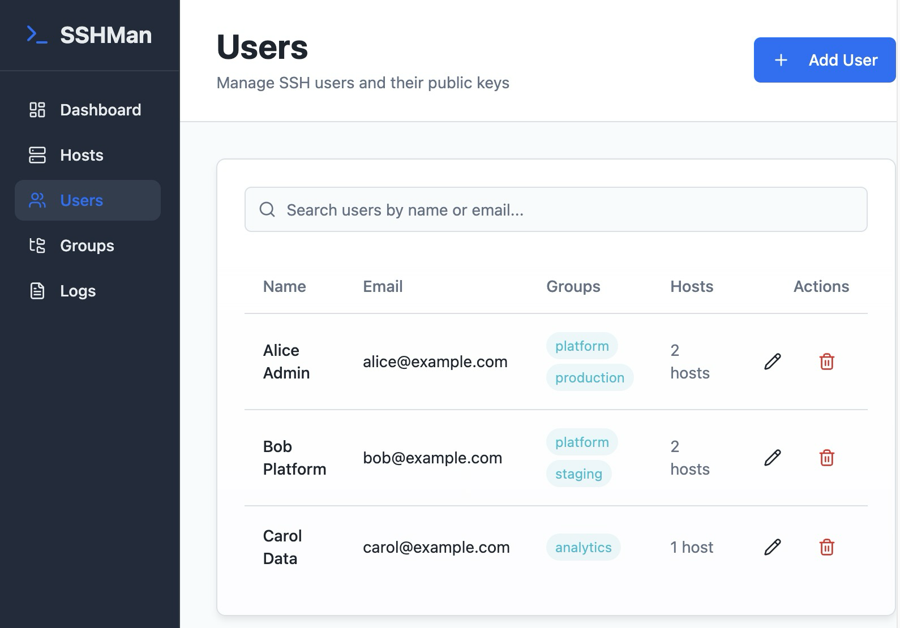
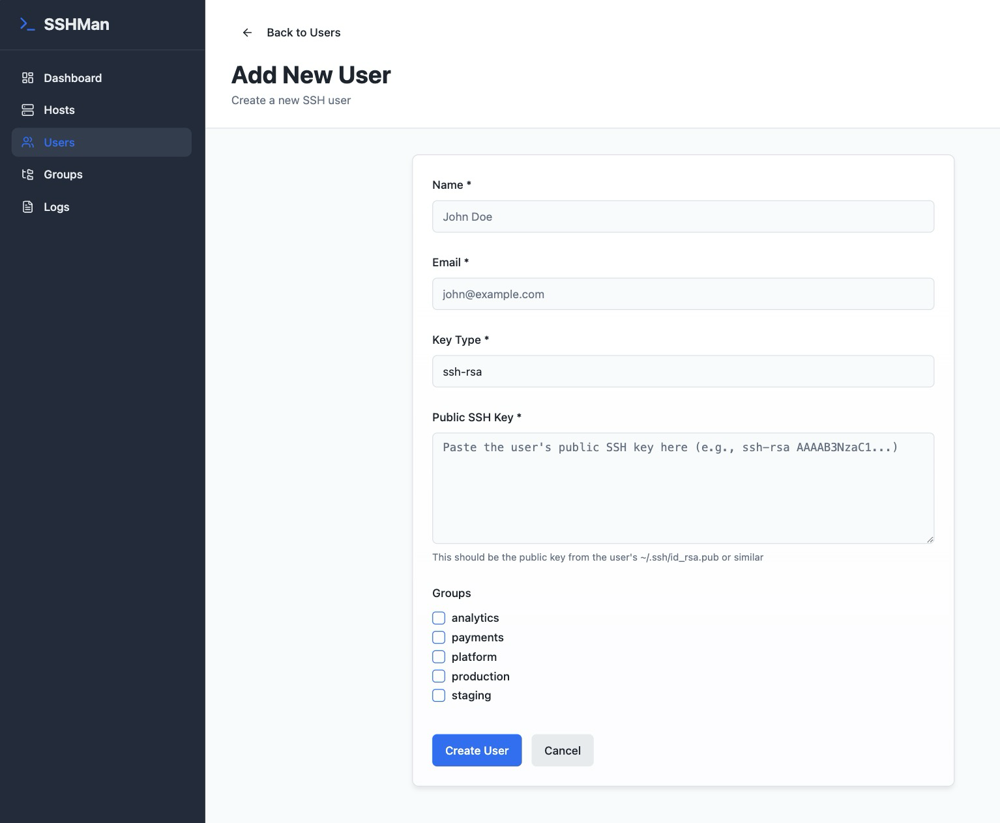

# SSH Manager - Manage Access Through Authorized Key Files on Remote Hosts

[](https://github.com/shoobyban/sshman/actions/workflows/push.yaml)
[](https://github.com/avelino/awesome-go)
[](https://goreportcard.com/report/github.com/shoobyban/sshman)

I built this to make onboarding and offboarding engineers less tedious across a
mix of environments: AWS boxes, third-party hosts, old servers nobody wants to
touch, all of that.

It solves a very specific operational problem I kept running into. If that is
also your problem, great. If not, you can still steal pieces of it.

**Caution**: Plan your group memberships carefully. Keep your management key out of any groups to avoid accidentally removing it from a host, which could lock you out.

## Installation

```sh
$ go install github.com/shoobyban/sshman@latest
```

Requirements:

- Go 1.25 or newer

If you are building from a checkout instead of installing the released CLI,
build the embedded frontend first:

```sh
make frontend
go build ./...
```

## How Does It Work?

Run `sshman` from a machine that can already reach the rest of your fleet over
SSH using a management key that is not shared with other people.

Configuration lives in `~/.ssh/.sshman`. If you move the tool to another
machine, copy that file and the binary and you are most of the way there. The
file stores hosts, users, and groups. It does not store private keys.

The two main things in `sshman` are users and hosts. Users are keyed by their
public SSH key and labeled with an email-like identifier. That identifier does
not have to be a real email address. `sam-key-1` and `sam-key-2` work just as
well if that fits how you manage keys.



The real center of the tool is the group. Groups are just tags shared between
users and hosts. If a user and a host share a group name, that user should be
on that host.

In practice that usually means groups like `production`, `staging`,
`client1`, or `live-hosts`.

When you add a host, `sshman` connects to it, reads its `authorized_keys`, and
pulls that state back into the local config. That gives you a starting point
instead of forcing you to rebuild access state by hand.



### Configuration File

`~/.ssh/.sshman` is a JSON snapshot of your known hosts, users, and groups. It
is closer to a local state file than a classic config file.

## Usage

Here is the shape of the CLI.

### Command Structure

It is organized by resource: `user`, `host`, `group`, `role`, plus a few global
commands.

```
sshman
├── user
│   ├── add <email> <sshkey.pub> [flags]
│   ├── remove <email>
│   ├── list
│   ├── rename <old_email> <new_email>
│   └── groups <email> [groups...]
├── host
│   ├── add <alias> <host:port> <user> <keyfile> [flags]
│   ├── remove <alias>
│   ├── list
│   ├── rename <old_alias> <new_alias>
│   └── groups <alias> [groups...]
├── group
│   └── list
├── role
│   ├── assign --user <email> --role <role>
│   └── list
├── sync
├── tree - this command
├── web
└── version
```

### Global Flags

- `--config <file>`: Path to the configuration file.
- `--verbose`: Enable verbose output.

### User Management (`sshman user`)

#### Add a User

Add a user:

```bash
sshman user add <email> <sshkey.pub> --group <group1> --group <group2>
```

- `<email>`: A unique identifier for the user (e.g., `email@test.com`).
- `<sshkey.pub>`: Path to the user's public SSH key.
- `--group`: (Optional, repeatable) The group(s) to which the user belongs.

**Example:**

```bash
sshman user add email@test.com ~/.ssh/user1.pub --group production-team --group staging-hosts
```

#### Remove a User

Remove a user and clean them off managed hosts:

```bash
sshman user remove <email>
```

**Example:**

```bash
sshman user remove email@test.com
```

#### List Users

List users and their groups:

```bash
sshman user list
```

**Example Output:**

```
email@test.com          [production-team staging-hosts]
junior1@test.com        [dev-team]
```

#### Rename a User

Rename a user identifier:

```bash
sshman user rename <old_email> <new_email>
```

**Example:**

```bash
sshman user rename email@test.com new-email@test.com
```

#### Manage User Groups

Set or replace a user's groups:

```bash
sshman user groups <email> [groups...]
```

- If groups are provided, the user's groups will be replaced with the new list.
- If no groups are provided, the user will be removed from all groups.

**Example:**

```bash
sshman user groups email@test.com production-team dev-team
```

### Host Management (`sshman host`)

#### Add a Host

Add a host:

```bash
sshman host add <alias> <host:port> <user> <keyfile> --group <group1>
```

- `<alias>`: A short, unique name for the host (e.g., `google`).
- `<host:port>`: The host's address and SSH port.
- `<user>`: The user to connect with.
- `<keyfile>`: Path to the private SSH key for connecting to the host.
- `--group`: (Optional, repeatable) The group(s) to which the host belongs.

**Example:**

```bash
sshman host add google my.google.com:22 myuser ~/.ssh/google --group deploy --group hosting
```

#### Remove a Host

Remove a host:

```bash
sshman host remove <alias>
```

**Example:**

```bash
sshman host remove google
```

#### List Hosts

List hosts, connection targets, and groups:

```bash
sshman host list
```

**Example Output:**

```
google                  my.google.com:22                    [deploy hosting]
client1.live            www.client1.com:22                  [production-team]
```

#### Rename a Host

Rename a host alias:

```bash
sshman host rename <old_alias> <new_alias>
```

**Example:**

```bash
sshman host rename google google-prod
```

#### Manage Host Groups

Set or replace a host's groups:

```bash
sshman host groups <alias> [groups...]
```

**Example:**

```bash
sshman host groups google deploy production
```

### Group Management (`sshman group`)

#### List Groups

List groups and the users and hosts attached to them:

```bash
sshman group list
```

**Example Output:**

```
production-team hosts: [client1.live]
production-team users: [email@test.com]
dev-team hosts: [client1.staging]
dev-team users: [junior1@test.com]
```

### Role Management (`sshman role`)

#### Assign a Role to a User

Assign a role to a user:

```bash
sshman role assign --user <email> --role <role_name>
```

**Note:** Roles can only be assigned to users, not hosts.

**Example:**

```bash
sshman role assign --user email@test.com --role admin
```

#### List Roles

List roles:

```bash
sshman role list
```

### Sync Configuration (`sshman sync`)

Refresh local state from the remote hosts:

```bash
sshman sync
```

This is useful when somebody edits `authorized_keys` directly and you need to
pull reality back into the local state file.

### Web UI (`sshman web`)

Start the web UI:

```bash
sshman web --port 8080
```

- `--port`: (Optional) The port to run the web UI on.
- `--bind`: (Optional) The IP address to bind to. Defaults to `127.0.0.1`.
- `--allow-remote`: Required when binding to a non-loopback address such as
  `0.0.0.0`.
- `--enable-keys-api`: Exposes the `/api/keys` endpoint. Disabled by default.

The web UI is an admin surface. It only listens on loopback by default so you
do not accidentally expose host and user management to the network.

To bind the web UI to all interfaces intentionally:

```bash
sshman web --bind 0.0.0.0 --allow-remote --port 8080
```

### Development Sandbox

The repo includes a Docker sandbox for checking the embedded web UI and the SSH
propagation flow without pointing the tool at real infrastructure.

```bash
docker compose -f docker-compose.sandbox.yml up --build -d
```

That starts:

- the embedded app on <http://localhost:18080>
- disposable SSH target containers seeded with sample hosts, users, and groups

### Version (`sshman version`)

Print the version:

```bash
sshman version
```
- [ ] All other core functionality should have unit tests
- [x] Edge case: deleting user should delete the user from all hosts (unless canceled from changeset)

- [ ] Misfeature: Changing keyfile on host does not upload new key with old and delete old
- [ ] Misfeature: Adding host does not check if host config is working
- [ ] Misfeature: Adding host with groups does not upload initial users from group
- [ ] Misfeature: Modifying user groups does not upload / delete hosts

### TODO For Next Release

- [ ] Web authentication
- [ ] Delete host with editing ssh keys
- [ ] Auto-group host specific users (when user is on several hosts, create a group for them, auto-merge groups when possible)
- [ ] CLI to use API (not sure)
- [ ] Web Interface Authentication (where to store creds?)
- [ ] Updated At timestamps
- [ ] Audit log
  - [ ] audit log logging all changes from changeset (sync op) on apply
- [ ] Implement user "role" group of groups for RBAC level of abstraction (developers role = uat-servers+staging-servers group)
- [ ] Testing connection after creating authorized_keys entry

### (Possible) Future Plans

- [ ] Changeset based operation (see [Future plans details](docs/Plans.md))
- [ ] Web Aria tags (at least tagging buttons better and connecting labels)
- [ ] More backend (currently `.ssh/.sshman` JSON configuration file)
- [ ] Adding host key to server using password auth
- [ ] Text UI based on Web frontend
- [ ] State handling (see [Future plans details](docs/Plans.md))
- [ ] Edit multiple items (see [Future plans details](docs/Plans.md))

## Credits

Most of the credit goes to the pain of being a CTO for 17+ years in small and mid-sized companies, where SSH key management is not solved.

The project would have been much harder without the work of [Steve Francia](https://github.com/spf13) and all the cobra and viper contributors, the web UI relies on [Chi](https://github.com/go-chi/chi) and [React](https://github.com/facebook/react).

Web UI embedding wouldn't be working without [Gregor Best](https://github.com/farhaven), who nerd-sniped me into helping with a tricky bug on Gophers Slack.

I love the Go community.
