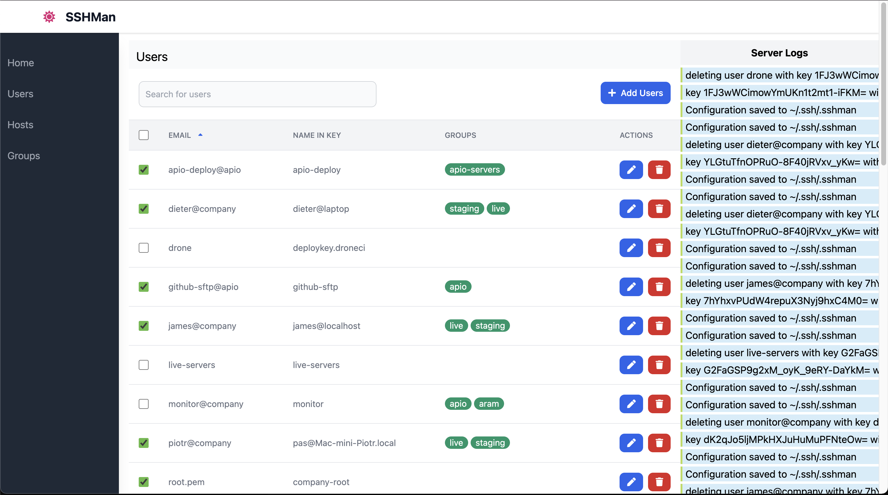

# SSH Manager - Manage Access Through Authorized Key Files on Remote Hosts

[](https://github.com/shoobyban/sshman/actions/workflows/push.yaml)
[](https://github.com/avelino/awesome-go)
[](https://goreportcard.com/report/github.com/shoobyban/sshman)

This is a simple tool I created to streamline the onboarding and offboarding of engineers across various environments, from AWS to third-party hosting providers.

As with all my creations, this tool solves _my_ problem. While it may not solve yours, I welcome feedback, fixes, pull requests, and issues.

**Caution**: Plan your group memberships carefully. Keep your management key out of any groups to avoid accidentally removing it from a host, which could lock you out.

## Installation

```sh
$ go get github.com/shoobyban/sshman
```

## How Does It Work?

This tool must be run from a host that can access all other hosts using a working SSH key that is not shared with anyone else. Configuration is saved in `~/.ssh/.sshman`. If you need to move the tool to another host, copy this file and the binary, and you're set up. The configuration does not contain any sensitive information.

There are two main resource entities in sshman: users and hosts. Users are identified by their public SSH key and labeled by their email address for simplicity. However, the email address is not used as an email and can be any identifier, such as `sam-key-1` or `sam-key-2`. This is useful when a user has multiple keys for different purposes, although it is not necessary in most cases.



The main concept of sshman is the group, which organizes users into "groups of hosts" or hosts into "groups of users." Examples include `live-hosts`, `staging-hosts`, `production`, or `{client1}`, `{client2}`. Groups act as tags; by tagging a user and a host with the same group name, the user gains access to the host.

To add a host to the sshman configuration, provide an alias, an SSH `.pub` key, and the groups the host belongs to (if already defined). Adding the host triggers an auto-discovery feature that downloads all SSH keys from the host as newly defined users and creates pseudo-groups for recognized users with access to that host.


### Configuration File

Configuration is saved in `~/.ssh/.sshman`. It is a JSON file containing all hosts, users, and groups. "Configuration" might not be the best term for this file.

## Usage

This section provides a comprehensive overview of the `sshman` command-line interface.

### Command Structure

The CLI is organized around resources like `user`, `host`, and `group`, with actions such as `add`, `remove`, `list`, and `rename` as subcommands.

```
sshman
├── user
│   ├── add <email> <sshkey.pub> [flags]
│   ├── remove <email>
│   ├── list
│   ├── rename <old_email> <new_email>
│   └── groups <email> [groups...]
├── host
│   ├── add <alias> <host:port> <user> <keyfile> [flags]
│   ├── remove <alias>
│   ├── list
│   ├── rename <old_alias> <new_alias>
│   └── groups <alias> [groups...]
├── group
│   └── list
├── role
│   ├── assign --user <email> --role <role>
│   └── list
├── sync
├── tree - this command
├── web
└── version
```

### Global Flags

- `--config <file>`: Path to the configuration file.
- `--verbose`: Enable verbose output.

### User Management (`sshman user`)

#### Add a User

To add a new user to the configuration:

```bash
sshman user add <email> <sshkey.pub> --group <group1> --group <group2>
```

- `<email>`: A unique identifier for the user (e.g., `email@test.com`).
- `<sshkey.pub>`: Path to the user's public SSH key.
- `--group`: (Optional, repeatable) The group(s) to which the user belongs.

**Example:**

```bash
sshman user add email@test.com ~/.ssh/user1.pub --group production-team --group staging-hosts
```

#### Remove a User

To remove a user from the configuration and all associated hosts:

```bash
sshman user remove <email>
```

**Example:**

```bash
sshman user remove email@test.com
```

#### List Users

To list all registered users and their group memberships:

```bash
sshman user list
```

**Example Output:**

```
email@test.com          [production-team staging-hosts]
junior1@test.com        [dev-team]
```

#### Rename a User

To change a user's email identifier:

```bash
sshman user rename <old_email> <new_email>
```

**Example:**

```bash
sshman user rename email@test.com new-email@test.com
```

#### Manage User Groups

To set or update a user's group memberships:

```bash
sshman user groups <email> [groups...]
```

- If groups are provided, the user's groups will be replaced with the new list.
- If no groups are provided, the user will be removed from all groups.

**Example:**

```bash
sshman user groups email@test.com production-team dev-team
```

### Host Management (`sshman host`)

#### Add a Host

To add a new host to the configuration:

```bash
sshman host add <alias> <host:port> <user> <keyfile> --group <group1>
```

- `<alias>`: A short, unique name for the host (e.g., `google`).
- `<host:port>`: The host's address and SSH port.
- `<user>`: The user to connect with.
- `<keyfile>`: Path to the private SSH key for connecting to the host.
- `--group`: (Optional, repeatable) The group(s) to which the host belongs.

**Example:**

```bash
sshman host add google my.google.com:22 myuser ~/.ssh/google.pub --group deploy --group hosting
```

#### Remove a Host

To remove a host from the configuration:

```bash
sshman host remove <alias>
```

**Example:**

```bash
sshman host remove google
```

#### List Hosts

To list all registered hosts, their connection details, and group memberships:

```bash
sshman host list
```

**Example Output:**

```
google                  my.google.com:22                    [deploy hosting]
client1.live            www.client1.com:22                  [production-team]
```

#### Rename a Host

To change a host's alias:

```bash
sshman host rename <old_alias> <new_alias>
```

**Example:**

```bash
sshman host rename google google-prod
```

#### Manage Host Groups

To set or update a host's group memberships:

```bash
sshman host groups <alias> [groups...]
```

**Example:**

```bash
sshman host groups google deploy production
```

### Group Management (`sshman group`)

#### List Groups

To list all groups and their associated users and hosts:

```bash
sshman group list
```

**Example Output:**

```
production-team hosts: [client1.live]
production-team users: [email@test.com]
dev-team hosts: [client1.staging]
dev-team users: [junior1@test.com]
```

### Role Management (`sshman role`)

#### Assign a Role to a User

To assign a role to a user:

```bash
sshman role assign --user <email> --role <role_name>
```

**Note:** Roles can only be assigned to users, not hosts.

**Example:**

```bash
sshman role assign --user email@test.com --role admin
```

#### List Roles

To list all available roles and their permissions:

```bash
sshman role list
```

### Sync Configuration (`sshman sync`)

To refresh the local configuration by fetching users from the `authorized_keys` files on all registered hosts:

```bash
sshman sync
```

This command is useful if `authorized_keys` files have been modified by a third party.

### Web UI (`sshman web`)

To start the web interface:

```bash
sshman web --port 8080
```

- `--port`: (Optional) The port to run the web UI on.
- `--bind`: (Optional) The IP address to bind to.

### Version (`sshman version`)

To display the version of `sshman`:

```bash
sshman version
```

### Things To Fix Before Release

- [x] Fix adding users
- [x] Bug: Adding host on frontend does not add keyfile entry into storage, edit afterwards does
- [x] Bug: Renaming host (alias) created a new entry, did not delete old
- [x] Group editing
  - [x] Add group should add users and groups
  - [x] Update group should remove / add resources
  - [x] Delete group should remove resources
- [x] Test all CRUD (users, hosts, groups) together
- [x] Re-read config with file watcher in web mode
- [x] Screenshot with test data (not with sensitive data)
- [x] Reuse stored ssh key for modifying user
- [x] Adding host to download information without the need of running update
- [x] Complete CRUD for missing use cases
- [x] Web interface
- [ ] Full test coverage
- [x] All user related functions should have unit tests
- [ ] All user role related functions should have unit tests
- [x] All host related functions should have unit tests
- [ ] All host group related functions should have unit tests
- [ ] All configuration handling functions should have unit tests
- [ ] All other core functionality should have unit tests
- [ ] Edge case: deleting user should delete the user from all hosts (unless canceled from changeset)
- [ ] Misfeature: Changing keyfile on host does not upload new key with old and delete old
- [ ] Misfeature: Adding host does not check if host config is working
- [ ] Misfeature: Adding host with groups does not upload initial users from group
- [ ] Misfeature: Modifying user groups does not upload / delete hosts

### TODO For Next Release

- [ ] Web authentication
- [ ] Delete host with editing ssh keys
- [ ] Auto-group host specific users (when user is on several hosts, create a group for them, auto-merge groups when possible)
- [ ] CLI to use API (not sure)
- [ ] Web Interface Authentication (where to store creds?)
- [ ] Updated At timestamps
- [ ] Audit log
  - [ ] audit log logging all changes from changeset (sync op) on apply
- [ ] Implement user "role" group of groups for RBAC level of abstraction (developers role = uat-servers+staging-servers group)
- [ ] Testing connection after creating authorized_keys entry

### (Possible) Future Plans

- [ ] Changeset based operation (see [Future plans details](docs/Plans.md))
- [ ] Web Aria tags (at least tagging buttons better and connecting labels)
- [ ] More backend (currently `.ssh/.sshman` JSON configuration file)
- [ ] Adding host key to server using password auth
- [ ] Text UI based on Web frontend
- [ ] State handling (see [Future plans details](docs/Plans.md))
- [ ] Edit multiple items (see [Future plans details](docs/Plans.md))

## Credits

Most of the credit goes to the pain of being a CTO for 17+ years in small and mid-sized companies, where SSH key management is not solved.

The project would have been much harder without the work of [Steve Francia](https://github.com/spf13) and all the cobra and viper contributors, the web UI relies on [Chi](https://github.com/go-chi/chi) and [Vue](https://github.com/vuejs/).

Web UI embedding wouldn't be working without [Gregor Best](https://github.com/farhaven), who nerd-sniped me into helping with a tricky bug on Gophers Slack.

I love the Go community.
